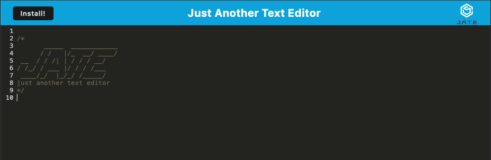

# PWA-Text-Editor

## Table of Contents

[Description](#description)
 
[Technologies Used](#technologies-used)
 
[Usage](#usage)
 
[Credits](#credits)

## Description

This is a text editor that allows users to create notes or code snippets so that they can be reliably retrieved for later use. It is a single-page application that meets the PWA criteria. It features a number of data-persistence techniques that serve as redundancy in case one of the options is not supported by the browser. It can be used with or without an internet connection.

This application is deployed using Render [here](https://pwa-text-editor-0wj9.onrender.com/)

A screenshot of the application:

## Technologies Used

- HTML
- CSS
- Javascript
- Express.js
- Node.js
- Webpack for bundling
- Service Worker for offline use
- IndexedDB for database storage

## Usage

- When you open the text editor, IndexedDB immediately creates a database storage

- When you enter content and click off of the DOM window, the content in the text editor is saved with IndexedDB

- When you reopen the text editor after closing it, the content in the text editor is retrieved from IndexedDB

- When you click on the install button, the web application can be downloaded as an icon on your desktop

- If you go offline, the page will still load as the static assets are pre cached upon loading along with subsequent pages and static assets

## Credits

* Starter code provided by edX Boot Camps LLC.
* All updates made by Conner Martin aka Conartisttt
